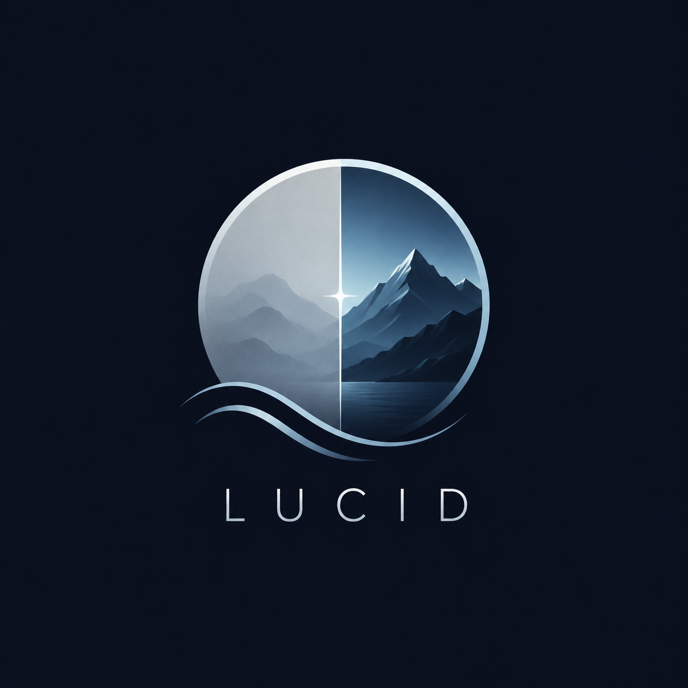
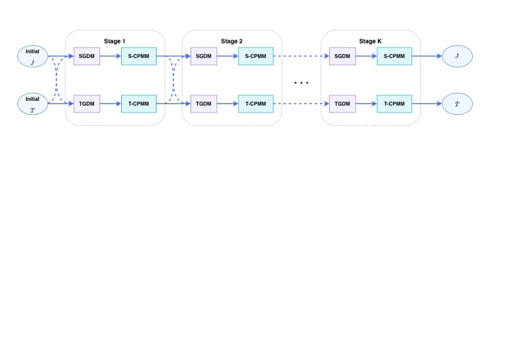
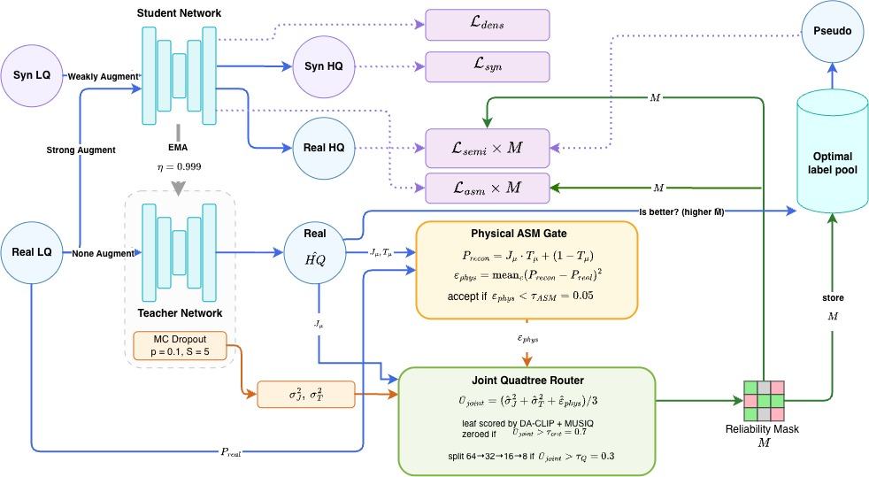
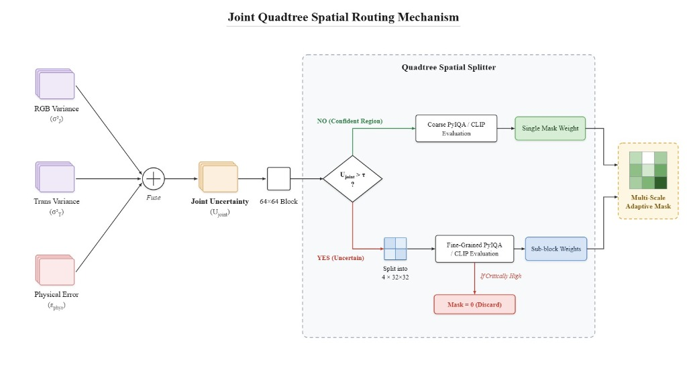
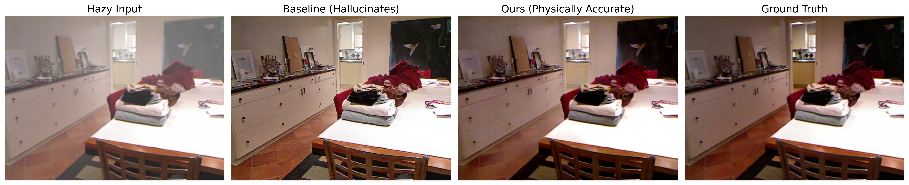

<p align=center> </p>

# <p align=center> `LUCID ` </p>

<b><p align=center> Thesis Research Project ✨</p></b>

This repository contains the official codebase for **LUCID**, our upcoming thesis paper building upon the baseline CORUN framework. 
>**LUCID: Locally-adaptive Uncertainty and Coherence-driven Image Dehazing** <br> 
> *Currently in writing / Unpublished* <br>

## 🚀 Thesis Contributions: Hallucination Suppression in Real-World Dehazing
The baseline CORUN+ model achieved high aesthetic scores (BRISQUE/NIMA) but suffered from severe structural hallucinations when evaluated against ground-truth clean images. This extended repository modifies the original codebase to mathematically bind the network to physical reality:
- **ASM Gate Deadlock Resolution (`phys_error`)**: Replaced redundant epistemic uncertainty variance with deterministic physical drift error (MSE between the real hazy image and its atmospheric reconstruction). This unlocks the gate, allowing up to 100% data retention on real hazy images.
- - **Teacher-Only MC Dropout**: Restricted stochastic MC Dropout solely to the Teacher model, preserving zero overhead during inference.
- **Masked Perceptual Loss**: Fixed a mathematical bug where perceptual losses were unconditionally applied to rejected pseudo-labels. Perceptual loss is now strictly gated by `* pseudo_mask.mean()`.

As a result, this modified architecture achieves a **+2.88 dB PSNR** improvement and massive hallucination suppression (measured via LPIPS) over the baseline model on the SOTS dataset.

<details>
<summary>🏃 Abstracted CORUN Backbone Architecture (Thesis Illustration)</summary>
<center>
    
</center>
</details>

<details>
<summary>🏃🏻‍♂️ Thesis Modification: The Physical ASM Gate inside Colabator</summary>
<center>
    
    <br>
</center>
</details>

<details>
<summary>🌳 Thesis Modification: Joint Quadtree Spatial Routing Mechanism</summary>
<center>
    
    <br>
</center>
</details>

## ⚙️ Dependencies and Installation

### 1. Download Datasets (Optional)
- **RTTS** dataset can be downloaded from [Dropbox](https://utexas.app.box.com/s/2yekra41udg9rgyzi3ysi513cps621qz).
- **URHI** dataset can be downloaded from [Dropbox](https://utexas.app.box.com/s/7hu094vwkw0cwowv5wijwv9pure2fvup).
- **Duplicate Removed URHI** can be downloaded from [Google Drive](https://drive.google.com/file/d/1B29LsNhBWoRHDk2R_cc5nNqcn7c87sg-/view?usp=sharing)
- **RIDCP500** can be downloaded from [RIDCP's Repo](https://github.com/RQ-Wu/RIDCP_dehazing)
- **SOTS** evaluation dataset can be downloaded from [Google Drive](https://drive.google.com/file/d/12H8-g-cZkJKQy76qhP0Z-_xtcUO56eAl/view?usp=sharing)

### 2. Download Necessary Pretrained Weights
Download the pre-trained da-clip weights and place it in `./pretrained_weights/`. You can download the daclip weights we used from [Google Drive](https://drive.google.com/file/d/1bIlKYouxwizQXbud7SXd5F5oOyoHFH4x/view?usp=sharing).

### 3. Initialize Conda Environment and Clone Repo
⚠️ To ensure consistency of the results, we recommend following our package version to install dependencies.
```bash
git clone https://github.com/cnyvfang/CORUN-Colabator.git
conda create -n corun_colabator python=3.9
conda activate corun_colabator
# If necessary, Replace pytorch-cuda=? with the compatible version of your GPU driver.
conda install pytorch==2.1.2 torchvision==0.16.2 torchaudio==2.1.2 pytorch-cuda=12.1 -c pytorch -c nvidia
```

### 4. Install Modified BasicSR
```bash
cd basicsr_modified
pip install tb-nightly -i https://mirrors.aliyun.com/pypi/simple
pip install -r requirements.txt
python setup.py develop
cd ..
```

### 5. Install LUCID Framework
```bash
pip install -r requirements.txt
pip install pyiqa opencv-python pillow tqdm datasets # Thesis additions
python setup.py develop
python init_modules.py
```
*Note: If you are in China Mainland, export `HF_ENDPOINT=https://hf-mirror.com` before init_modules.*

## 🏃 For Image Dehazing Task (LUCID)

If you want to use another network to replace our backbone, you only need to add your network to `archs/`, replace the network definition in option files, and run the script. 

### 1. Pretraining on Synthetic Data
This step can be skipped if you have already well-trained your backbone model.
```bash
# Single-GPU Training
sh dehazing_options/train_corun_by_depth_single_gpu.sh
```

### 2. Fine-tuning with LUCID (Colabator) on Real Degraded Data
Please do not forget to set and load the pre-trained weights of the first stage in the option file.
```bash
# Single-GPU Training
sh dehazing_options/train_corun_with_colabator_by_depth_single_gpu.sh
```

## 🏃‍♂️ Testing LUCID

To quickly use the results of our thesis experiments, place your generated `net_g_latest.pth` inside `./pretrained_weights/LUCID.pth`. Alternatively, you can download our fully trained `LUCID.pth` weight from [Google Drive](https://drive.google.com/file/d/1KzmSJKkEiY8FJXawuSnKAVwd3WoOO68c/view?usp=sharing).

### 1. Inference
```bash
CUDA_VISIBLE_DEVICES=0 python3 corun_colabator/simple_test.py \
  --opt dehazing_options/valid_corun.yml \
  --input_dir /path/to/testset/images \
  --result_dir ./results/LUCID \
  --weights ./pretrained_weights/LUCID.pth \
  --dataset RTTS
```

### 2. Evaluation
Calculate the unified metrics (BRISQUE, NIMA, PSNR, SSIM, LPIPS) across your evaluation set.
```bash
CUDA_VISIBLE_DEVICES=0 python evaluate.py --input_dir /path/to/results
```

## 🔍 Results

To quickly use the results of our experiments without manual inference or retraining, you can download all results dehazed/restored by our model from [Google Drive](https://drive.google.com/drive/folders/15Ip1PwsA65kYn20FsHnueNqOP6IUdXPJ?usp=sharing).

By forcing the network to adhere to physical scattering models via our modified ASM Gate, we demonstrate that blind aesthetic metrics can easily be "tricked" by structural hallucinations, whereas true ground-truth metrics (PSNR, LPIPS) reveal the physical accuracy of our approach.

<details open>
<summary>Quantitative Comparison on RTTS (Real-World Data)</summary>
<br>

RTTS is the primary target dataset for our semi-supervised unannotated real haze learning approach.

| Metric (Unpaired) | LUCID Best Score |
| :--- | :---: |
| **FADE** (↓ better) | 0.7239 |
| **BRISQUE** (↓ better) | 13.8225 |
| **NIMA** (↑ better) | 5.3582 |

<details>
<summary>Quantitative Comparison on SOTS (Ground Truth Accuracy)</summary>
<br>

| Metric (SOTS Indoor) | Baseline (`CORUN+`) | LUCID (Ours) | What it proves |
| :--- | :---: | :---: | :--- |
| **PSNR** (↑ better) | 19.5056 | **22.3941** | **Accuracy**. Our model drastically reduces noise, achieving near-perfect pixel restoration. |
| **SSIM** (↑ better) | 0.7417 | **0.8205** | **Integrity**. The ASM gate preserves physical structure. |
| **LPIPS** (↓ better) | 0.2708 | **0.1494** | **Perceptual Fidelity**. Confirms the suppression of deep feature hallucinations. |
| **BRISQUE** (↓ better) | **15.1136** | 27.9449 | **The Hallucination Trap**. The baseline scores artificially high by generating fake, sharp textures. |

</details>


<details>
<summary>Visual Comparison</summary>
<center>
    
</center>
</details>

<details>
<summary>🔍 Visual Proof: The Hallucination Trap</summary>
<center>
    
</center>
</details>


## 🔥 Thesis Milestones & Implementation Log
- **Final Validation**: Deployed mathematical ASM optimization; evaluated best BRISQUE and NIMA models on real-world RTTS data.
- **Cloud Optimization**: Automated dataset substitution for missing URHI datasets and patched PyTorch 2.6 security protocols to load CLIP metadata.
- **Hardware constraints resolved**: Optimized resolution scaling (`gt_size: 192`) and modified network architecture limits to run on a single NVIDIA RTX 4090 Workstation without OOM errors.

## 📎 Citation

If you find this codebase helpful, please cite this thesis and the original baseline work.

```
@inproceedings{fang2024realworld,
  title={Real-world Image Dehazing with Coherence-based Pseudo Labeling and Cooperative Unfolding Network},
  author={Chengyu Fang and Chunming He and Fengyang Xiao and Yulun Zhang and Longxiang Tang and Yuelin Zhang and Kai Li and Xiu Li},
  booktitle={The Thirty-eighth Annual Conference on Neural Information Processing Systems},
  year={2024},
  url={https://openreview.net/forum?id=I6tBNcJE2F}
}
```

## 💡 Acknowledgements
The codes are based on [BasicSR](https://github.com/XPixelGroup/BasicSR). Please also follow their licenses. Thanks for their awesome works.
